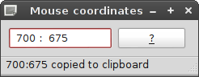

CoordApp is a simple mouse-coordinates displayer.

Press Ctrl-C to copy coordinates.
Press Space to stop refreshing.
Press G for a faster refresh (but fallbacks after one click).
Press A to stay always on top.

CoordApp requires Python and PyQt6.
CoordApp is licensed under the [Do What the Fuck You Want to Public License](http://wtfpl.net)
