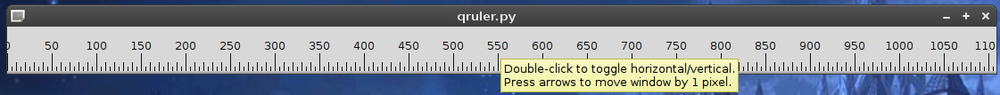

QRuler displays a simple pixel ruler.
Double-click the ruler to toggle vertical/horizontal orientation.
Press arrow keys to move the ruler by 1 pixel in a direction.

QRuler needs on Python and PyQt6.
QRuler is licensed under the [Do What the Fuck You Want to Public License](http://wtfpl.net)

